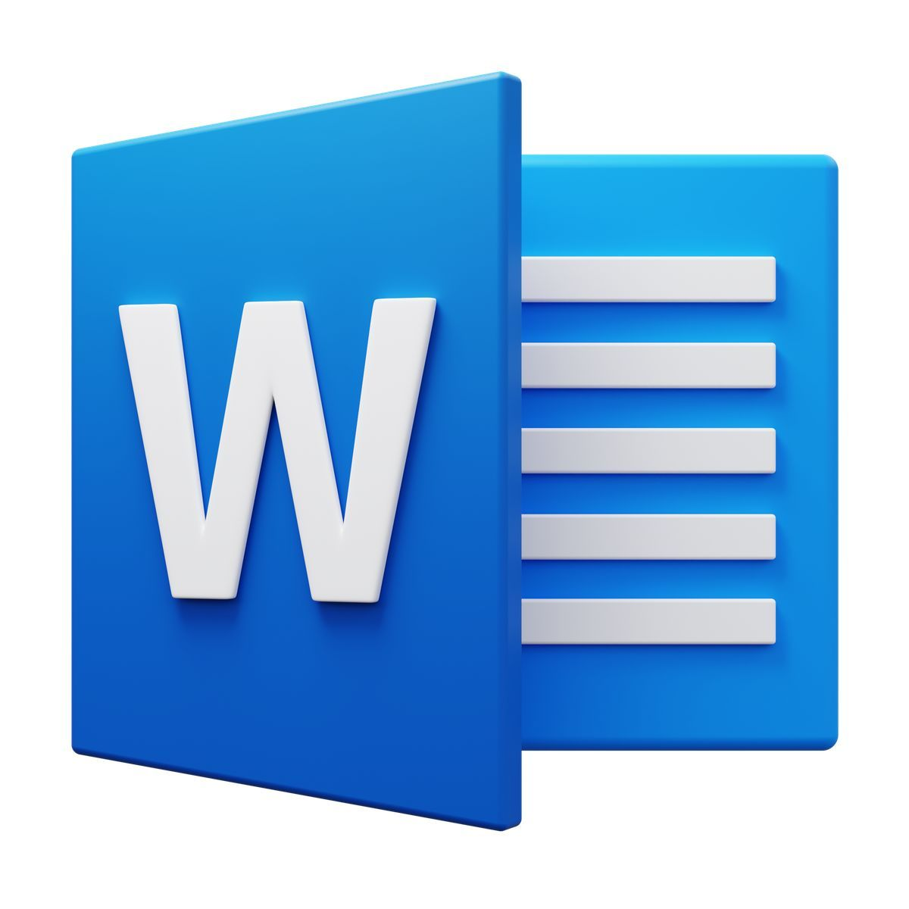

# `.docx` – Microsoft Word Dokument

 

---

## Was ist `.docx`?

`.docx` ist das Dateiformat von **Microsoft Word**. Word gehört zur **Microsoft Office Suite** – zusammen mit Programmen wie Excel (Tabellenkalkulation) und PowerPoint (Präsentationen).

Word ist ein **Textverarbeitungsprogramm**: Es ermöglicht das Schreiben und Gestalten von Texten mit weitreichenden Formatierungsoptionen – zum Beispiel Schriftarten, Überschriften, Tabellen, Spalten und Seitenumbrüche.

---

## Womit öffnen?

`.docx`-Dateien werden primär mit **Microsoft Word** geöffnet.

Word ist kostenpflichtig.

---

