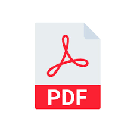

# `.pdf` – Portable Document Format

 

---

## Was ist `.pdf`?

**PDF** steht für **Portable Document Format**. Es wurde von Adobe entwickelt und ist heute ein offener Standard.

Das Besondere an PDF: Das **Layout bleibt immer gleich** – egal auf welchem Gerät, welchem Betriebssystem oder in welchem Programm die Datei geöffnet wird. Schriften, Abstände und Bilder sehen überall identisch aus.

---

## Womit öffnen?

`.pdf`-Dateien lassen sich mit vielen Programmen öffnen – ohne extra Installation:

- **Browser** (Chrome, Firefox, Edge) – einfach reinziehen
- **Adobe Acrobat Reader** – kostenlos
- **Windows**: integrierter PDF-Viewer
- **macOS/iOS**: Vorschau (kostenlos)

---