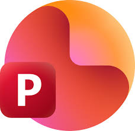

# `.pptx` – Microsoft PowerPoint Präsentation

 

---

## Was ist `.pptx`?

`.pptx` ist das Dateiformat von **Microsoft PowerPoint** – einem Programm zur Erstellung von **Präsentationen**. Es gehört zur **Microsoft Office Suite** (zusammen mit Word, Excel u. a.) und ist kostenpflichtig.

---

## Womit öffnen?

`.pptx`-Dateien lassen sich mit **Microsoft PowerPoint** öffnen, ansehen und bearbeiten. Kostenlose Alternativen sind **LibreOffice Impress** sowie **Google Slides** im Browser.

---

