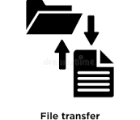

# Online-Transferdienste

 

---

## Was sind Online-Transferdienste?

Online-Transferdienste wie **WeTransfer** oder **Swisstransfer** ermöglichen den Versand großer Dateien über einen Link – meist ist nur eine E-Mail nötig und kein Konto. Man lädt die Datei hoch, bekommt einen Link und schickt diesen weiter.

Der Link löscht sich nach einer bestimmten Zeit automatisch, ein dauerhafter Speicher ist also nicht möglich. Auch gemeinsames Arbeiten an einer Datei ist nicht vorgesehen. Zudem stellt sich – ähnlich wie bei Cloud-Diensten – die Frage wo die Daten gespeichert werden.

Sie eignen sich gut für den einmaligen Versand einer größeren Datei, wenn Sender und Empfänger keine gemeinsame Plattform nutzen.

---