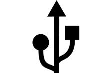

# USB-Stick

 

---

## Was ist ein USB-Stick?

Ein USB-Stick ist ein kleines Speichermedium das direkt an einen Computer angeschlossen wird. Er benötigt kein Internet – Dateien werden einfach draufkopiert und weitergegeben.

Allerdings muss der Stick physisch übergeben werden, was bedeutet dass beide Personen am selben Ort sein müssen. Außerdem kann er verloren gehen oder beschädigt werden.

Er eignet sich gut wenn keine Internetverbindung vorhanden ist oder wenn man ohnehin vor Ort ist.

---
